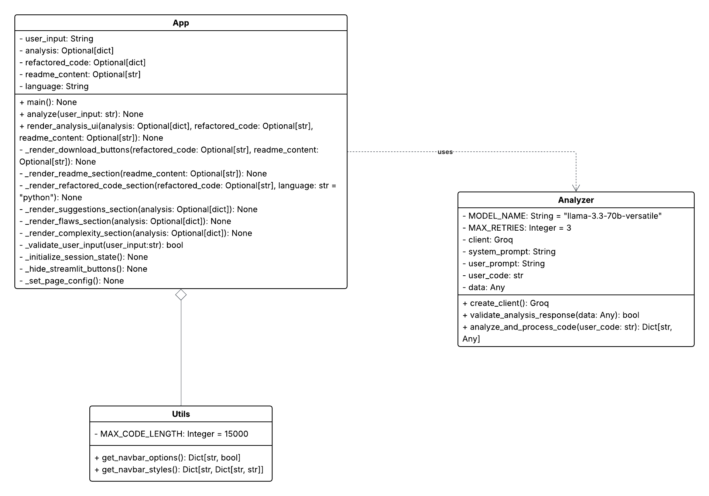
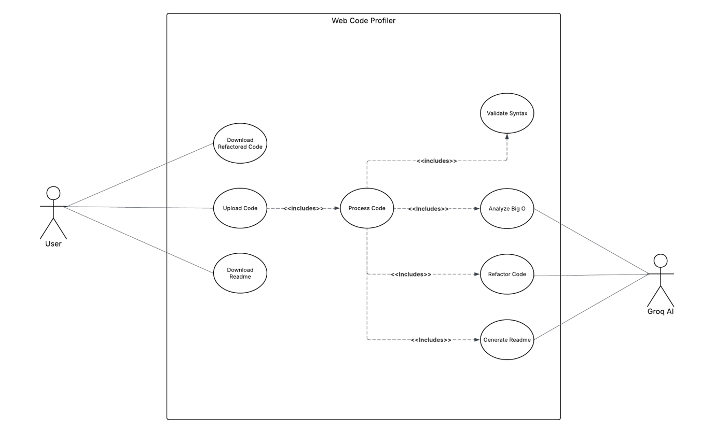
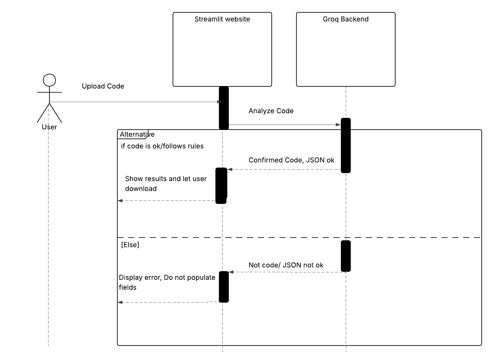

# Code Buddy :) - AI-Powered Code Profiler

### Authors: Caleb Peters, Matt Simone, Alex Mulder
### Institution: Grand Valley State University
### Course: CIS 350

## 1. Abstract
Software development takes time and effort to do well, but **Code Buddy** aims to ease the task for developers of all skill-levels. **Code Buddy** is a website designed to help programmers create better code. Users simply upload their code and the code will be analyzed by AI to offer suggestions including Big O analysis, identified flaws, docstrings, comments, and coding conventions. Then, the user will be able to download the refactored code and the provided README. **Code Buddy** will not only save time, but it will also save developers from headaches by identifying flaws and possible bottlenecks before they arise.

## 2. Introduction
Large Language Models have changed the way that software is developed, but trying to "vibe code" can easily turn into fighting with the model rather than creating quality software. Even if you code something functional with an LLM, it may be riddled with bugs and security risks. **Code Buddy** aims to use AI to build code faster and better without the headaches.

**Code Buddy** is an intelligent Python source code analysis website built with Streamlit and powered by Groq (Qwen3). Once the user uploads their code, Groq will analyze it for time and space complexity, performance bottlenecks, security concerns, and PEP 8 violations. Our website will return the report with detailed explanations, a README file, and a new version of the code with type hints, docstrings, and improved readability. The user will be able to export the refactored code and documentation instantly as .py and .md files.

## 3. Architectural Design
The **Code Buddy** website is built entirely with Python. The frontend uses the Streamlit library. The backend implements the LLM prompts, API integration with GroqCloud, and JSON response validation. The website takes in the user's pasted code or uploaded .py file to give to the Groq Qwen3 model to analyze. The Groq Qwen3 model returns a detailed report with explanations, a README file, and a new version of the code with type hints, docstrings, and improved readability. The user will be able to export the refactored code and documentation instantly as .py and .md files.

### 3.1 Class Diagram
<figure align="center">
    
    <figcaption>Figure 1: Class Diagram</figcaption>
</figure>

### 3.2 Use Case Diagram
<figure align="center">
    
    <figcaption>Figure 2: Use Case Diagram</figcaption>
</figure>

### 3.3 Sequence Diagram
<figure align="center">
    
    <figcaption>Figure 3: Sequence Diagram</figcaption>
</figure>

## 4. User Guide/Implementation
### Prerequisites
* A Groq API Key (Get one at console.groq.com)
* Python 3.8 or higher

### Installation & Usage
1. Clone the repository: 
    ```bash
   git clone https://github.com/Arcerite/CAM_CODING_PROFILER
    ```
3. Install dependencies: 
    ```bash
    pip install -r requirements.txt
    ```

4. Configure Environment: Create a .env file and add
    ``` GROQ_API_KEY=your_key_here```
5. Run the App: 
    ```python 
    python -m streamlit run app.py
    ```

## 5. Risk Analysis and Retrospective
To be added...

## 6. Future Scope
To be added...

## 7. Conclusion
To be added...

## 8. Walkthrough
To be added...
